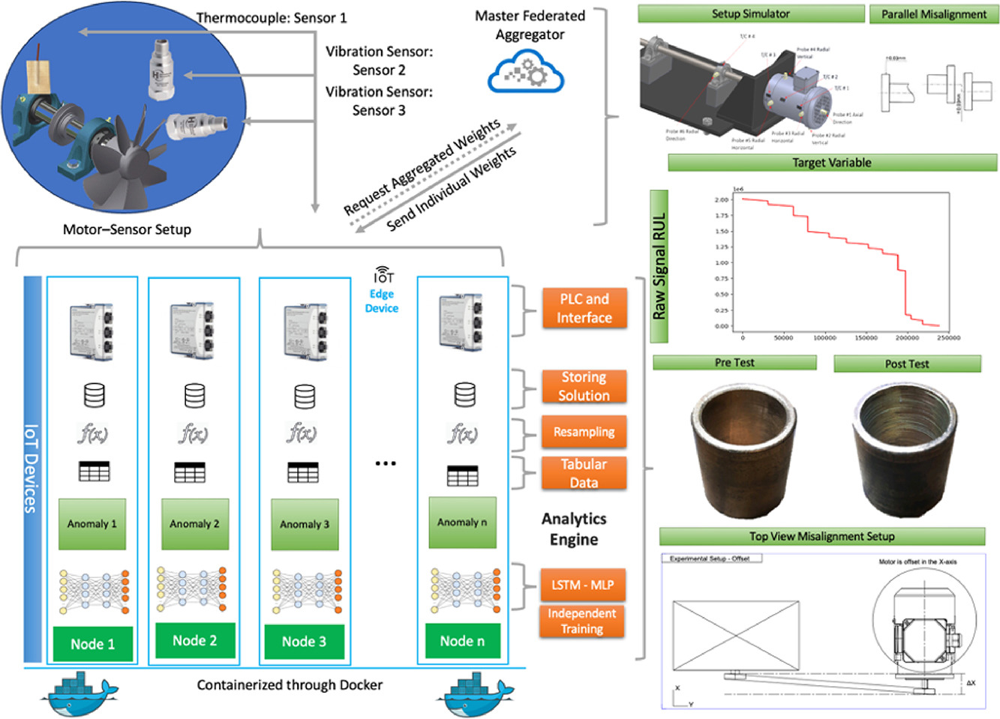

# Scalable Federated Learning



This repository contains a complete federated learning testbed for IoT network anomaly detection, implementing multiple state-of-the-art FL algorithms with support for both LSTM and MLP models under varying NIID conditions based on the Dirichlet distribution.

## Overview

This project implements and compares **eight federated learning methods** - four traditional baseline methods and four advanced state-of-the-art algorithms:

**Traditional Methods (Baselines):**
- **FedAvg** (Federated Averaging) - The foundational FL algorithm
- **FedAvgM** (Federated Averaging with Momentum) - FedAvg with server-side momentum
- **FedOpt** (Federated Optimization) - Adaptive server-side optimization
- **QFedAvg** (Q-Fair Federated Averaging) - Fair resource allocation across clients

**Advanced Methods (State-of-the-Art):**
- **MOON** (Model-Contrastive Federated Learning) - Contrastive learning for non-IID data
- **FedALA** (Federated Averaging with Learnable Aggregation) - Adaptive aggregation weights
- **StatAvg** (Statistical Averaging) - Statistical information integration
- **DASHA** (Distributed Accelerated Stochastic Heavy Ball) - Momentum-based acceleration

## 📂 Project Structure

```
FL_Detection_PublicStaging/
├── fl_testbed/                          # Core FL implementation
│   └── version2/
│       ├── client/                      # Client-side implementations
│       │   ├── dirichelet_split.py      # Non-IID data partitioning
│       │   ├── independent.py           # Independent baseline training
│       │   ├── federated_client_RUL_*.py    # LSTM clients (8 methods)
│       │   │   ├── federated_client_RUL_FedAvg.py
│       │   │   ├── federated_client_RUL_FedAvgM.py
│       │   │   ├── federated_client_RUL_FedOpt.py
│       │   │   ├── federated_client_RUL_QFedAvg.py
│       │   │   ├── federated_client_RUL_MOON.py
│       │   │   ├── federated_client_RUL_FedALA.py
│       │   │   ├── federated_client_RUL_StatAvg.py
│       │   │   └── federated_client_RUL_DASHA.py
│       │   ├── federated_client_OFFSET_*.py # MLP clients (8 methods)
│       │   └── CustomNumpyClient_*.py   # Custom Flower clients
│       ├── server/                      # Server-side implementations
│       │   ├── federated_server_RUL_*.py    # LSTM servers (8 methods)
│       │   ├── federated_server_OFFSET_*.py # MLP servers (8 methods)
│       │   └── CustomStrategy_*.py      # Custom aggregation strategies
│       └── data/
│           ├── initial/                 # Raw data and preprocessing scripts
│           └── transformed/             # Processed data (pickle files)
├── run_4methods_simple.sh               # Orchestration script for advanced methods (LSTM)
├── run_4methods_simple_MLP.sh           # Orchestration script for advanced methods (MLP)
├── docker-compose-4methods.yml          # Multi-container Docker setup
├── Dockerfile                           # Container image definition
└── requirements.txt                     # Python dependencies
```

## Quick Start


### 1. Start the Environment

```bash
# Build and start all containers (4 methods × 6 containers each = 24 containers)
sudo docker compose -f docker-compose-4methods.yml up -d
```

### 2. Run Experiments

**LSTM Model (for RUL prediction):**
```bash
# Run advanced methods (MOON, FedALA, StatAvg, DASHA)
./run_4methods_simple.sh

# Run specific advanced methods only
./run_4methods_simple.sh MOON FedALA        # Run 2 methods in parallel
./run_4methods_simple.sh StatAvg            # Run 1 method

# Run traditional baseline methods manually (see Advanced Usage section)
```

**MLP Model (for offset detection):**
```bash
# Run advanced methods
./run_4methods_simple_MLP.sh

# Run specific methods
./run_4methods_simple_MLP.sh DASHA StatAvg  # Run 2 methods in parallel

# Run traditional baseline methods manually (see Advanced Usage section)
```

**Note:** The orchestration scripts currently support the 4 advanced methods (MOON, FedALA, StatAvg, DASHA). For traditional methods (FedAvg, FedAvgM, FedOpt, QFedAvg), see the "Running Individual Methods" section.

### 3. Collect Results

Results are automatically copied to the host directory as:
- `LSTM_<METHOD>_alpha_<VALUE>_<PARAM>_<VALUE>.txt` (LSTM results)
- `MLP_<METHOD>_alpha_<VALUE>_<PARAM>_<VALUE>.txt` (MLP results)


## Data Processing

### Non-IID Data Partitioning

Data is split using Dirichlet distribution:
```bash
python3 fl_testbed/version2/client/dirichelet_split.py \
    -alpha 0.1 \
    -beta 0.2 \
    -cm 5 \
    -motor 3 \
    -type LSTM
```

### Independent Baseline Training

For comparison, independent client training:
```bash
python3 fl_testbed/version2/client/independent.py \
    -ml 2 \
    -cn 15 \
    -cm 15 \
    -e 100 \
    -dfn 'M3_5_0_ddf_LSTM.pkl'
```

## Methods Description

### Traditional Baseline Methods

#### FedAvg (Federated Averaging)
The foundational federated learning algorithm that averages model parameters from all clients weighted by their dataset sizes.

**Key Features:**
- Simple weighted averaging
- Client updates computed via local SGD
- No server-side optimization

**Parameters:**
- `slr`: Server learning rate (typically 1.0 for pure averaging)
- `rounds`: Number of communication rounds
- `e`: Local epochs per round

#### FedAvgM (Federated Averaging with Momentum)
Extends FedAvg by applying server-side momentum to stabilize and accelerate convergence.

**Key Features:**
- Server-side momentum buffer
- Smoothed parameter updates
- Better convergence on non-IID data

**Parameters:**
- `server_momentum`: Momentum coefficient (typically 0.9)
- `slr`: Server learning rate
- `rounds`: Communication rounds

#### FedOpt (Federated Optimization)
Applies adaptive optimization algorithms (like Adam, Yogi, Adagrad) on the server side.

**Key Features:**
- Server-side adaptive learning rates
- Per-parameter optimization
- Faster convergence than FedAvg

**Parameters:**
- `server_optimizer`: Choice of optimizer (Adam, Yogi, Adagrad)
- `server_lr`: Server learning rate
- `beta1`, `beta2`: Optimizer hyperparameters

#### QFedAvg (Q-Fair Federated Averaging)
Fair federated learning that ensures equitable performance across all clients, not just average performance.

**Key Features:**
- Fairness-aware aggregation
- Lipschitz constant tracking
- Q-fairness objective

**Parameters:**
- `q`: Fairness parameter (higher = more fair)
- `slr`: Server learning rate
- `learning_rate`: Client learning rate

---

### Advanced State-of-the-Art Methods

#### MOON (Model-Contrastive Federated Learning)
Model-Contrastive Federated Learning uses contrastive learning to improve model consistency across clients with non-IID data.

**Key Features:**
- Contrastive loss between current, previous, and global models
- Improved representation learning
- Better handling of data heterogeneity

**Key Parameters:**
- `tau`: Temperature parameter for contrastive loss
- `mu`: Contrastive weight (balance between supervised and contrastive)
- `temperature`: Similarity temperature

#### FedALA (Federated Averaging with Learnable Aggregation)
Federated Averaging with Learnable Aggregation adaptively learns aggregation weights based on client performance.

**Key Features:**
- Adaptive layer-wise aggregation
- Client-specific local adapters
- Dynamic weight adjustment

**Key Parameters:**
- `tau`: Aggregation temperature
- `slr`: Server learning rate
- `eta`: Adapter learning rate

#### StatAvg (Statistical Averaging)
Statistical Averaging incorporates statistical information from client datasets into the aggregation process.

**Key Features:**
- Statistical batch normalization
- Data distribution awareness
- Improved generalization

**Key Parameters:**
- `tau`: Aggregation weight
- `slr`: Server learning rate
- `stat_alpha`: Statistical smoothing factor

#### DASHA (Distributed Accelerated Stochastic Heavy Ball)
Distributed Accelerated Stochastic Heavy Ball Algorithm accelerates convergence through momentum-based updates with variance reduction.

**Key Features:**
- Gradient compression and tracking
- Variance reduction
- Communication efficiency

**Key Parameters:**
- `tau`: Momentum parameter
- `slr`: Server learning rate
- `alpha`: Gradient smoothing coefficient

## 🔍 Monitoring & Debugging

### Check Container Status
```bash
sudo docker ps | grep fl_
```

### View Logs
```bash
# Server logs
sudo docker logs fl_moon_server

# Client logs
sudo docker logs fl_moon_client0
```

### GPU Verification
```bash
sudo docker exec fl_moon_server python3 -c "import tensorflow as tf; print(tf.config.list_physical_devices('GPU'))"
```


## Results Analysis

Results files contain per-round metrics:
- Training loss
- Validation accuracy
- Test accuracy
- Communication rounds
- Runtime

Example result file: `LSTM_MOON_alpha_0.01_tau_0.1.txt`


## Advanced Usage

### Running Individual Methods

**Advanced Methods (via orchestration scripts or manually):**
```bash
# Start MOON server
sudo docker exec -d fl_moon_server bash -c "cd /workspace && \
    python3 fl_testbed/version2/server/federated_server_RUL_MOON.py \
    -tau 0.1 -slr 0.01 -cm 5 -e 1 --rounds 1000 \
    -ip 172.18.1.10:8080"

# Start MOON clients
for i in {0..4}; do
    sudo docker exec -d fl_moon_client${i} bash -c "cd /workspace && \
        python3 fl_testbed/version2/client/federated_client_RUL_MOON.py \
        -dfn 'M3_5_${i}_ddf_LSTM.pkl' \
        -cm 5 -e 1 -ip 172.18.1.10:8080 -cn ${i}"
done
```

**Traditional Baseline Methods:**

All traditional methods are available but need to be run manually as they're not in the orchestration scripts:

```bash
# FedAvg
sudo docker exec -d fl_moon_server bash -c "cd /workspace && \
    python3 fl_testbed/version2/server/federated_server_RUL_FedAvg.py \
    -slr 1.0 -cm 5 -e 1 --rounds 1000 \
    -ip 172.18.1.10:7070 \
    -dfn_test_x '100_2_15_15_combined_offset_misalignment_M3.csv__client_centralizedtest_inputs.pkl' \
    -dfn_test_y '100_2_15_15_combined_offset_misalignment_M3.csv__client_centralizedtest_out.pkl' \
    -dfn 'M3_5_0_ddf_LSTM.pkl'"

for i in {0..4}; do
    sudo docker exec -d fl_moon_client${i} bash -c "cd /workspace && \
        python3 fl_testbed/version2/client/federated_client_RUL_FedAvg.py \
        -dfn 'M3_5_${i}_ddf_LSTM.pkl' \
        -cm 5 -e 1 -ip 172.18.1.10:7070 -cn ${i} \
        -dfn_test_x '100_2_15_15_combined_offset_misalignment_M3.csv__client_centralizedtest_inputs.pkl' \
        -dfn_test_y '100_2_15_15_combined_offset_misalignment_M3.csv__client_centralizedtest_out.pkl'"
done

# FedAvgM (with momentum)
sudo docker exec -d fl_moon_server bash -c "cd /workspace && \
    python3 fl_testbed/version2/server/federated_server_RUL_FedAvgM.py \
    -slr 1.0 -server_momentum 0.9 -cm 5 -e 1 --rounds 1000 \
    -ip 172.18.1.10:7071"

# FedOpt (with Adam optimizer)
sudo docker exec -d fl_moon_server bash -c "cd /workspace && \
    python3 fl_testbed/version2/server/federated_server_RUL_FedOpt.py \
    -server_lr 0.001 -cm 5 -e 1 --rounds 1000 \
    -ip 172.18.1.10:7072"

# QFedAvg (fair federated learning)
sudo docker exec -d fl_moon_server bash -c "cd /workspace && \
    python3 fl_testbed/version2/server/federated_server_RUL_QFedAvg.py \
    -q 0.2 -slr 1.0 -cm 5 -e 1 --rounds 1000 \
    -ip 172.18.1.10:7073"
```

**For MLP/Offset models**, replace `RUL` with `OFFSET` in the script names and use MLP data files:
```bash
# Example: FedAvg for OFFSET/MLP
sudo docker exec -d fl_moon_server bash -c "cd /workspace && \
    python3 fl_testbed/version2/server/federated_server_OFFSET_FedAvg.py \
    -slr 1.0 -cm 5 -e 1 --rounds 100 \
    -ip 172.18.1.10:7070 \
    -dfn_test_x '100_1_15_15_combined_offset_misalignment_M3.csv__client_centralizedX_test.pkl' \
    -dfn_test_y '100_1_15_15_combined_offset_misalignment_M3.csv__client_centralizedy_test.pkl' \
    -dfn 'M3_5_0_ddf_MLP.pkl'"
```

### Custom Parameters

Edit the orchestration scripts to modify:
- `alphas="0.001 0.01 0.1 1.0"` (line ~333)
- `FIXED_TAU=0.1` (line ~337)
- `FIXED_SLR=0.01` (line ~338)

## Troubleshooting

**GPU Out of Memory:**
- Run fewer methods in parallel (1-2 instead of 3-4)
- Reduce batch size in client scripts
- Restart containers: `sudo docker compose -f docker-compose-4methods.yml restart`

**Port Conflicts:**
- Check if ports 8080-11100 are available
- Modify port ranges in orchestration scripts

**Data Not Found:**
- Ensure data preprocessing completed successfully/executed first
- Check `fl_testbed/version2/data/transformed/` for pickle files
- Re-run data split scripts if needed

**Containers Not Starting:**
- Check Docker logs: `sudo docker compose -f docker-compose-4methods.yml logs`
- Verify GPU availability: `nvidia-smi`

## 📊 Results

### Performance Summary

**MLP Model (Offset Detection)** - Best configurations:

| Method | Alpha | S-LR | Param | Accuracy | F1 | MCS | Loss | Runtime (s) |
|--------|-------|------|-------|----------|----|----|------|-------------|
| FedOpt | 1M | 1.0 | 1e-9 | **~1.000** | **~1.000** | **0.995** | **0.162** | 1,289 |
| FedOpt | 1M | 1.0 | 1e-8 | **~1.000** | **~1.000** | **0.994** | 0.154 | 2,237 |
| QFedAvg | 0.075 | 1.0 | 0.1 | 0.910 | 0.900 | 0.881 | 0.307 | 5,275 |
| QFedAvg | 0.02 | 1.0 | 0.2 | 0.940 | 0.930 | 0.915 | 0.567 | 3,060 |
| FedAvg | 0.1 | - | - | 0.890 | 0.870 | 0.859 | 1.607 | 2,458 |

**LSTM Model (RUL Prediction)** - Best configurations:

| Method | Alpha | S-LR | Param | R² | MSE | MAE | Loss | Runtime (s) |
|--------|-------|------|-------|----|----|-----|------|-------------|
| FedAvgM | 0.001 | 0.001 | 0.0 | **0.979** | **0.197** | **0.403** | 0.098 | 3,765 |
| FedAvgM | 0.005 | 0.001 | 0.0 | 0.978 | 0.198 | 0.398 | 0.099 | 3,915 |
| QFedAvg | 0.001 | 0.01 | 0.2 | 0.979 | 0.197 | 0.405 | 0.098 | 4,521 |
| FedAvgM | 0.01 | 0.001 | 0.0 | 0.979 | 0.197 | 0.409 | 0.098 | 3,821 |
| QFedAvg | 0.005 | 0.01 | 0.2 | 0.976 | 0.198 | 0.408 | 0.099 | 4,765 |

**Key Findings:**
- **MLP**: FedOpt with high alpha (1M) and learning rate (1.0) achieves near perfect accuracy (~1.000)
- **LSTM**: FedAvgM with low alpha (0.001) and minimal momentum achieves best R² (0.979)
- **Non-IID Impact**: Higher alpha values generally improve performance across all methods
- **Runtime**: Traditional methods (FedAvg, FedAvgM, FedOpt) ~2-4x faster than fairness-based QFedAvg

📄 **[View Complete Results Table](results.md)** - All experimental configurations with detailed metrics

### Visualization Dashboards

#### MLP Model (Offset Detection)

<table>
<tr>
<td><br/><b>FedAvg</b></td>
<td><br/><b>FedOpt</b></td>
</tr>
<tr>
<td><br/><b>FedAvgM</b></td>
<td><br/><b>QFedAvg</b></td>
</tr>
</table>

#### LSTM Model (RUL Prediction)

<table>
<tr>
<td><br/><b>FedAvg</b></td>
<td><br/><b>FedOpt</b></td>
</tr>
<tr>
<td><br/><b>FedAvgM</b></td>
<td><br/><b>QFedAvg</b></td>
</tr>
</table>

<!-- Complete results traditional methods with all parameter combinations are available in [resutls.txt](resutls.txt). -->

<!-- ## 📝 Citation

If you use this code in your research, please cite:

```bibtex
@article{your_paper,
  title={Federated Learning for IoT Network Anomaly Detection},
  author={Your Name},
  year={2026}
}
``` -->


## 📧 Contact

jtupayachi.github.io


## Star History

[](https://www.star-history.com/#jtupayachi/FL_Detection_PublicStaging&type=timeline&legend=top-left)